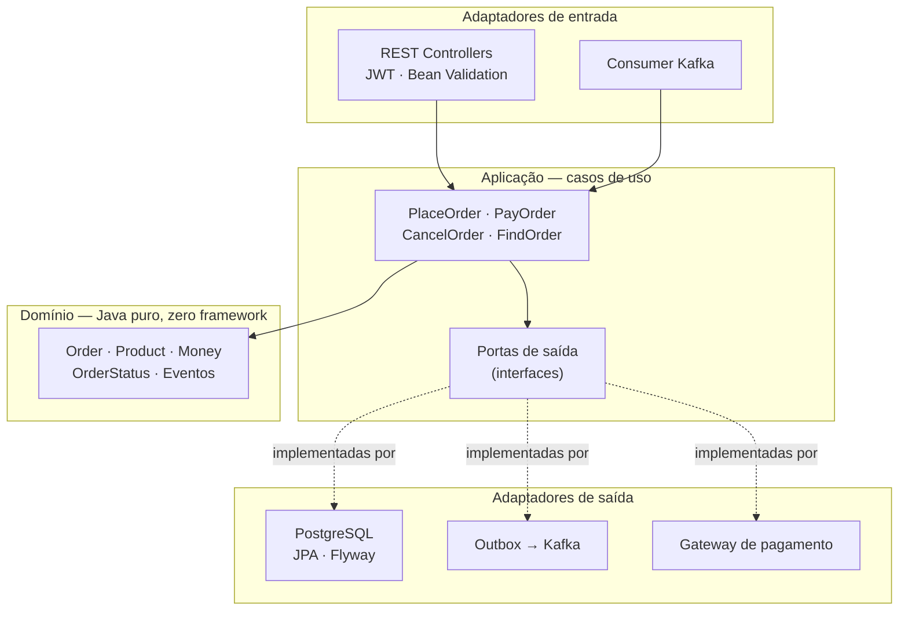
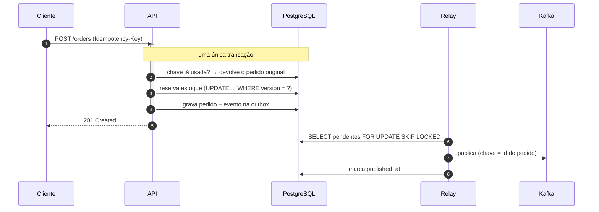

# OrderFlow API

API de pedidos em **Java 21 + Spring Boot 3.5** com arquitetura hexagonal, escrita em volta
dos três problemas que quebram um checkout de verdade: **pedido duplicado**, **venda de
estoque que não existe** e **evento que se perde entre o banco e o broker**.

[](https://github.com/BrunoBergamin/orderflow/actions/workflows/ci.yml)


---

## Por que este projeto existe

Um CRUD de pedidos qualquer pessoa escreve. O que separa um sistema que aguenta produção
é como ele se comporta **quando algo dá errado**: a rede cai no meio do POST, dois clientes
disputam a última unidade, o Kafka fica indisponível bem na hora do commit.

Cada decisão aqui responde a uma dessas situações, e cada uma tem um teste automatizado
provando que funciona.

| Problema real | Solução aplicada | Onde está provado |
|---|---|---|
| Cliente clica duas vezes em "comprar" e a rede cai; o app repete o POST | Chave `Idempotency-Key` com índice único no banco | `OrderApiIT.idempotenciaEvitaPedidoDuplicado` |
| 20 pessoas disputam 5 unidades ao mesmo tempo | Lock otimista (`@Version`) + `CHECK (stock >= 0)` | `ConcurrentStockIT` |
| O pedido foi salvo mas o evento não saiu (ou o contrário) | Transactional Outbox + relay assíncrono | `OutboxRelayIT` |
| Chamada ao gateway prendendo conexão do pool do banco | Cobrança **fora** da transação, gravação em transação curta | `PayOrderService` |
| Regra de negócio vazando para controller e repositório | Arquitetura hexagonal validada por ArchUnit no CI | `ArchitectureTest` |
| Cliente enxergando pedido de outro cliente | Autorização por dono do recurso dentro do caso de uso | `OrderApiIT.naoEnxergaPedidoDeOutro` |

---

## Rodando em 1 comando

```bash
git clone https://github.com/BrunoBergamin/orderflow.git
cd orderflow
docker compose up --build
```

Sobe PostgreSQL, Kafka (KRaft, sem ZooKeeper) e a API. Quando terminar:

- **Swagger UI:** http://localhost:8080/swagger-ui.html
- **Health:** http://localhost:8080/actuator/health
- **Métricas Prometheus:** http://localhost:8080/actuator/prometheus

Usuários criados automaticamente para a demonstração:

| E-mail | Senha | Perfil |
|---|---|---|
| `cliente@orderflow.dev` | `cliente123` | CUSTOMER |
| `admin@orderflow.dev` | `admin123` | ADMIN |

### Fluxo completo em 4 chamadas

```bash
# 1. Autentica
TOKEN=$(curl -s -X POST http://localhost:8080/api/v1/auth/login \
  -H 'Content-Type: application/json' \
  -d '{"email":"cliente@orderflow.dev","password":"cliente123"}' | jq -r .accessToken)

# 2. Escolhe um produto do catálogo (rota pública)
PRODUTO=$(curl -s http://localhost:8080/api/v1/products | jq -r '.content[0].id')

# 3. Cria o pedido com chave de idempotência
PEDIDO=$(curl -s -X POST http://localhost:8080/api/v1/orders \
  -H "Authorization: Bearer $TOKEN" \
  -H "Idempotency-Key: compra-001" \
  -H 'Content-Type: application/json' \
  -d "{\"items\":[{\"productId\":\"$PRODUTO\",\"quantity\":2}]}" | jq -r .id)

# Repita o passo 3 com a MESMA chave: devolve 200 com o mesmo pedido, não cria outro.

# 4. Paga (use "tok_decline" para ver o caminho da recusa e a devolução de estoque)
curl -s -X POST http://localhost:8080/api/v1/orders/$PEDIDO/payment \
  -H "Authorization: Bearer $TOKEN" \
  -H 'Content-Type: application/json' \
  -d '{"paymentToken":"tok_visa_4242"}' | jq
```

---

## Arquitetura

Hexagonal (Ports & Adapters). As dependências apontam **sempre para dentro**: a
infraestrutura conhece o domínio, o domínio não conhece ninguém.



**A regra acima não é um desenho, é um teste.** `ArchitectureTest` roda no CI e quebra o
build se alguém importar JPA dentro do domínio, chamar repositório do controller ou criar
um ciclo entre pacotes.

### Estrutura de pastas

```
domain/          Regra de negócio pura. Sem Spring, sem JPA, sem Jackson.
  model/         Order (raiz do agregado), Product, Money, OrderItem, OrderStatus
  event/         OrderPlaced, OrderPaid, OrderCancelled
  exception/     Falhas de negócio tipadas

application/     Orquestração dos casos de uso
  port/in/       O que a aplicação oferece (PlaceOrderUseCase...)
  port/out/      O que a aplicação precisa (OrderRepositoryPort...)
  service/       Implementação dos casos de uso

infrastructure/  Todo o resto — a parte descartável
  adapter/in/    REST, consumidor Kafka
  adapter/out/   JPA, outbox, gateway de pagamento
  security/      JWT, filtro de autenticação
  config/        Spring, OpenAPI, agendador
```

---

## O fluxo de um pedido



O ponto central: **o evento é gravado na mesma transação do pedido**. Se o banco der
rollback, o evento some junto; se o Kafka estiver fora do ar, a linha fica pendente e o
relay tenta de novo. Nunca existe pedido sem evento nem evento sem pedido.

---

## Decisões de projeto

Registradas aqui porque a pergunta em entrevista nunca é "o que você usou", é **"por quê"**.

<details>
<summary><b>Por que Transactional Outbox em vez de <code>kafkaTemplate.send()</code> no serviço?</b></summary>

Publicar direto cria uma escrita dupla sem transação distribuída: se o `send()` funciona e
o commit falha, o resto do sistema reage a um pedido que não existe; se o commit funciona e
o `send()` falha, o pedido existe e ninguém fica sabendo.

A outbox transforma o envio em uma linha de tabela — atômico com o resto. O preço é entrega
*at-least-once*: o consumidor precisa ser idempotente, e isso está documentado no
`OrderEventsConsumer`.
</details>

<details>
<summary><b>Por que <code>FOR UPDATE SKIP LOCKED</code> no relay?</b></summary>

Para a aplicação escalar horizontalmente. Com duas instâncias rodando, cada uma tranca seu
próprio lote e as outras **pulam** essas linhas em vez de esperar. Sem isso, ou os eventos
sairiam duplicados, ou as instâncias formariam fila numa trava.
</details>

<details>
<summary><b>Por que lock otimista e não <code>SELECT ... FOR UPDATE</code>?</b></summary>

Conflito de estoque é raro em relação ao volume de leituras. O lock pessimista serializaria
todo mundo e derrubaria a vazão para proteger um caso que quase não acontece. O otimista
deixa todos correrem e só rejeita quem perdeu a corrida — com 409 e um `Retry-After`
implícito, já que repetir tende a funcionar.

`ConcurrentStockIT` prova o invariante: `estoque final = estoque inicial − pedidos criados`,
nunca negativo.
</details>

<details>
<summary><b>Por que o gateway de pagamento é chamado fora da transação?</b></summary>

Chamada de rede dentro de `@Transactional` segura uma conexão do pool durante todo o
round-trip. Com o adquirente lento, o pool esgota e a API inteira para — inclusive
requisições que nem tocam em pagamento.

O fluxo é: lê o pedido → cobra fora de transação → abre uma transação curta
(`OrderPaymentApplier`) só para gravar o desfecho. A janela entre ler e gravar é coberta
pelo lock otimista. O `OrderPaymentApplier` é um bean separado de propósito: `@Transactional`
só funciona quando a chamada passa pelo proxy do Spring, e uma auto-invocação
(`this.apply(...)`) seria silenciosamente ignorada.
</details>

<details>
<summary><b>Por que modelo de domínio separado das entidades JPA?</b></summary>

Custa um mapeador. Em troca, `Order` não tem construtor vazio público, não tem setter de
status e não carrega anotação nenhuma — o que torna as regras testáveis em milissegundos,
sem subir contexto Spring, e impede que uma decisão de schema (uma coluna denormalizada,
um índice) vire mudança de regra de negócio.
</details>

<details>
<summary><b>Por que Spring Boot 3.5 e não a 4.x?</b></summary>

É a linha que a maioria das empresas roda hoje, com o ecossistema (springdoc, Testcontainers,
bibliotecas de JWT) estável em cima dela. Portfólio que não compila na stack real do time
não ajuda ninguém.
</details>

<details>
<summary><b>Por que o gateway de pagamento é simulado?</b></summary>

Uma chave de sandbox de terceiro tornaria os testes não reproduzíveis e dependentes de rede.
O que importa arquiteturalmente é o **contrato** (`PaymentGatewayPort`): trocar por um
cliente HTTP real é escrever outra classe em `adapter/out/payment`, sem tocar em caso de uso
nem em domínio. Os tokens `tok_decline` e `tok_fraud` deixam o caminho de recusa testável
sem mock de rede.
</details>

---

## Testes

```bash
./mvnw test      # 45 testes unitários + arquitetura (~15s, não precisa de Docker)
./mvnw verify    # + 18 testes de integração com PostgreSQL real (precisa de Docker)
```

| Camada | Quantidade | O que cobre |
|---|---|---|
| Domínio | 20 | Regras de negócio puras: total, transições de status, estoque, dinheiro |
| Casos de uso | 13 | Orquestração com Mockito: idempotência, autorização, devolução de estoque |
| Arquitetura | 8 | ArchUnit: dependências apontando para dentro, sem ciclos, JPA fora do domínio |
| API (integração) | 16 | HTTP → JWT → caso de uso → JPA → PostgreSQL, sem mock |
| Concorrência | 1 | 20 threads disputando 5 unidades |
| Outbox + Kafka | 1 | Evento gravado → publicado → marcado como entregue |
| **Total** | **63** | |

Os testes de integração usam **PostgreSQL real via Testcontainers**, não H2. Recursos que
este projeto depende — `FOR UPDATE SKIP LOCKED`, índice parcial, `TIMESTAMPTZ`, o
comportamento do lock otimista sob concorrência — ou não existem no H2 ou se comportam
diferente. Um container sobe uma vez e serve a suíte inteira.

O Hibernate roda com `ddl-auto: validate`: se uma entidade e a migration do Flyway
divergirem, o teste quebra na hora em vez de o erro aparecer no deploy.

---

## Endpoints

| Método | Rota | Acesso | Descrição |
|---|---|---|---|
| `POST` | `/api/v1/auth/login` | público | Emite o JWT |
| `GET` | `/api/v1/products` | público | Lista o catálogo (paginado) |
| `GET` | `/api/v1/products/{id}` | público | Detalha um produto |
| `POST` | `/api/v1/products` | ADMIN | Cadastra produto |
| `POST` | `/api/v1/orders` | autenticado | Cria pedido (aceita `Idempotency-Key`) |
| `GET` | `/api/v1/orders` | autenticado | Lista pedidos (ADMIN vê todos) |
| `GET` | `/api/v1/orders/{id}` | autenticado | Detalha pedido do próprio cliente |
| `POST` | `/api/v1/orders/{id}/payment` | autenticado | Cobra no gateway |
| `POST` | `/api/v1/orders/{id}/cancellation` | autenticado | Cancela e devolve estoque |

### Respostas de erro

Todo erro sai em **RFC 7807** (`application/problem+json`), com os campos que o cliente
precisa para reagir:

```json
{
  "type": "https://orderflow.dev/errors/estoque-insuficiente",
  "title": "Estoque insuficiente",
  "status": 422,
  "detail": "estoque insuficiente para o SKU CAD-005: solicitado 5, disponivel 2",
  "sku": "CAD-005",
  "requested": 5,
  "available": 2,
  "timestamp": "2026-08-11T15:04:05Z"
}
```

| Status | Quando |
|---|---|
| `400` | Validação de campo (lista `errors[]` com campo e mensagem) |
| `401` | Token ausente, expirado ou inválido |
| `403` | Pedido de outro cliente, ou rota que exige ADMIN |
| `404` | Pedido ou produto inexistente |
| `409` | Transição de status inválida, conflito de concorrência, `Idempotency-Key` em corrida |
| `422` | Estoque insuficiente |
| `500` | Erro inesperado — devolve `errorId` correlacionado ao log, nunca stack trace |

---

## Stack

| Camada | Tecnologia |
|---|---|
| Linguagem | Java 21 (records, sealed-friendly, virtual threads) |
| Framework | Spring Boot 3.5.16 — Web, Data JPA, Security, Validation, Actuator |
| Banco | PostgreSQL 16 + Flyway (migrations versionadas) |
| Mensageria | Apache Kafka (KRaft) via Spring Kafka |
| Segurança | JWT HS256 (jjwt), BCrypt, stateless |
| Documentação | springdoc-openapi (Swagger UI) |
| Testes | JUnit 5, AssertJ, Mockito, Testcontainers, ArchUnit, JaCoCo |
| Observabilidade | Actuator + Micrometer/Prometheus |
| Build & entrega | Maven, Docker multi-stage com camadas, GitHub Actions |

---

## Detalhes de produção que costumam faltar

- `spring.jpa.open-in-view: false` — sessão aberta até o fim da resposta transforma
  qualquer getter LAZY em consulta escondida na camada web.
- `hibernate.default_batch_fetch_size: 50` — carrega as coleções de uma página inteira em
  um único `IN (...)`, eliminando o N+1 sem paginar em memória.
- Índice parcial em `outbox_event (created_at) WHERE published_at IS NULL` — o relay só
  consulta pendentes; indexar os já publicados custaria escrita para sempre.
- `Clock` injetado — nenhum `Instant.now()` solto: os testes congelam o tempo e afirmam a
  data exata em vez de comparar com tolerância.
- Container roda como usuário não-root, com `MaxRAMPercentage` para a JVM respeitar o
  limite de memória do container (causa clássica de `OOMKilled` no Kubernetes).
- Login devolve a mesma mensagem para e-mail inexistente e senha errada — senão a API vira
  um verificador de quais e-mails estão cadastrados.
- `POST /orders/{id}/payment` e `/cancellation` como sub-recursos: modelam a **ação de
  negócio**, não um `PATCH` genérico de status que aceitaria qualquer transição.

---

## Próximos passos

- [ ] Cache de catálogo com Redis e invalidação por evento
- [ ] Rate limiting por cliente (Bucket4j)
- [ ] Tracing distribuído com OpenTelemetry
- [ ] Deploy com Terraform + ECS Fargate
- [ ] Contract testing entre produtor e consumidor dos eventos

---

## Autor

**Bruno Alves Bergamin** — desenvolvedor back-end Java

[LinkedIn](https://www.linkedin.com/in/bruno-alves-bergamin-6b711a347)

Licença MIT — veja [LICENSE](LICENSE).
