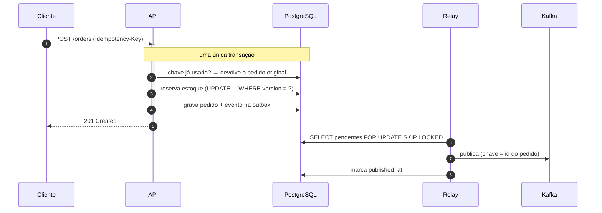

# OrderFlow — API de pedidos

[](https://github.com/BrunoBergamin/orderflow/actions/workflows/ci.yml)


API de pedidos em Java 21 e Spring Boot. Escrevi para estudar as partes que um CRUD não
ensina — as que só aparecem quando algo dá errado no meio do caminho.

## Os três problemas que este projeto resolve

**O cliente clicou duas vezes em comprar.** Ou a rede caiu depois do POST e o app repetiu a
chamada. Sem tratamento, viram dois pedidos e duas cobranças. Aqui o cliente manda um
cabeçalho `Idempotency-Key`; a chave tem índice único no banco, e repetir a chamada devolve
o pedido original com 200 em vez de criar outro.

**Duas pessoas disputando a última unidade.** Se as duas leem "estoque = 1" e as duas
gravam "estoque = 0", a loja vendeu dois de um produto que tinha um. O estoque usa lock
otimista (`@Version`): o `UPDATE` sai com `WHERE version = ?`, o segundo não acerta nenhuma
linha e recebe 409. Tem um teste com 20 threads disputando 5 unidades que verifica o
invariante — estoque final = estoque inicial − pedidos criados, nunca negativo.

**O pedido salvou mas o evento não saiu.** Ou o contrário. Publicar direto no Kafka dentro
do caso de uso cria uma escrita dupla sem transação: se o `send()` funciona e o commit
falha, o resto do sistema reage a um pedido que não existe. A solução é o Transactional
Outbox — o evento é gravado numa tabela na mesma transação do pedido, e um relay assíncrono
entrega no Kafka depois, com retentativa.

## Rodando

```bash
docker compose up --build
```

Sobe PostgreSQL, Kafka (KRaft, sem ZooKeeper) e a API. Swagger em
http://localhost:8080/swagger-ui.html.

Dois usuários já vêm criados: `cliente@orderflow.dev` / `cliente123` e
`admin@orderflow.dev` / `admin123`.

```bash
TOKEN=$(curl -s -X POST http://localhost:8080/api/v1/auth/login \
  -H 'Content-Type: application/json' \
  -d '{"email":"cliente@orderflow.dev","password":"cliente123"}' | jq -r .accessToken)

PRODUTO=$(curl -s http://localhost:8080/api/v1/products | jq -r '.content[0].id')

# Cria o pedido. Repita com a MESMA Idempotency-Key: devolve 200 com o mesmo pedido.
curl -X POST http://localhost:8080/api/v1/orders \
  -H "Authorization: Bearer $TOKEN" \
  -H "Idempotency-Key: compra-001" \
  -H 'Content-Type: application/json' \
  -d "{\"items\":[{\"productId\":\"$PRODUTO\",\"quantity\":2}]}"
```

Para pagar, use qualquer token. `tok_decline` recusa por saldo e `tok_fraud` por fraude —
os dois devolvem o estoque.

## O caminho de um pedido



## Decisões que valem explicar

**A cobrança no gateway acontece fora da transação.** Chamada de rede dentro de
`@Transactional` segura uma conexão do pool durante todo o round-trip; com o adquirente
lento, o pool esgota e a API inteira para — inclusive requisições que nem tocam em
pagamento. O fluxo é: lê o pedido, cobra fora de transação, e abre uma transação curta só
para gravar o desfecho. A janela entre ler e gravar é coberta pelo lock otimista.

Isso obrigou a separar o `OrderPaymentApplier` em outro bean. `@Transactional` só vale
quando a chamada passa pelo proxy do Spring — se o método morasse na mesma classe e fosse
chamado com `this.apply(...)`, a anotação seria silenciosamente ignorada.

**`FOR UPDATE SKIP LOCKED` no relay da outbox.** É o que permite rodar várias instâncias da
aplicação: cada uma tranca o próprio lote e as outras pulam essas linhas em vez de esperar.
Sem isso, ou os eventos sairiam duplicados, ou as instâncias formariam fila numa trava.

**Lock otimista em vez de pessimista.** Conflito de estoque é raro perto do volume de
leituras. O pessimista serializaria todo mundo para proteger um caso que quase não acontece.
O otimista deixa todos correrem e rejeita quem perdeu a corrida — com 409, e repetir tende a
funcionar.

**Modelo de domínio separado das entidades JPA.** Custa um mapeador. Em troca, `Order` não
tem construtor vazio público nem setter de status, e não carrega anotação nenhuma — as
regras rodam em milissegundos, sem subir contexto Spring, e uma decisão de schema não vira
mudança de regra de negócio.

**Pagamento e cancelamento são sub-recursos** (`POST /orders/{id}/payment`), não um `PATCH`
de status. Modelam a ação de negócio; um PATCH genérico aceitaria qualquer transição.

**O gateway é simulado, de propósito.** Chave de sandbox de terceiro deixaria os testes
dependentes de rede e não reproduzíveis. O que importa arquiteturalmente é o contrato
(`PaymentGatewayPort`): trocar por um cliente HTTP real é escrever outra classe em
`adapter/out/payment`, sem tocar em caso de uso nem em domínio.

## Testes

```bash
./mvnw test      # 45 testes, ~15s, não precisa de Docker
./mvnw verify    # + 18 testes de integração com PostgreSQL real
```

São 63 no total: 20 de domínio, 13 de casos de uso com Mockito, 8 regras de arquitetura,
16 de API, 1 de concorrência e 1 do outbox com Kafka.

Os testes de integração usam **PostgreSQL real via Testcontainers**, não H2. As coisas de
que este projeto depende — `FOR UPDATE SKIP LOCKED`, índice parcial, `TIMESTAMPTZ`, o
comportamento do lock otimista sob concorrência — ou não existem no H2 ou se comportam
diferente. Um container sobe uma vez e serve a suíte inteira.

O Hibernate roda com `ddl-auto: validate`, então se uma entidade e a migration do Flyway
divergirem o teste quebra na hora, e não no deploy.

**A arquitetura hexagonal virou teste.** As 8 regras do `ArchitectureTest` (ArchUnit) rodam
no CI e quebram o build se alguém importar JPA dentro do domínio, chamar repositório do
controller ou criar ciclo entre pacotes. Diagrama em README envelhece; regra que roda no CI,
não.

## Endpoints

| Método | Rota | Acesso |
|---|---|---|
| `POST` | `/api/v1/auth/login` | público |
| `GET` | `/api/v1/products` · `/{id}` | público |
| `POST` | `/api/v1/products` | ADMIN |
| `POST` | `/api/v1/orders` | autenticado (aceita `Idempotency-Key`) |
| `GET` | `/api/v1/orders` · `/{id}` | autenticado (ADMIN vê todos) |
| `POST` | `/api/v1/orders/{id}/payment` | autenticado |
| `POST` | `/api/v1/orders/{id}/cancellation` | autenticado |

Todo erro sai em RFC 7807 (`application/problem+json`). Estoque insuficiente é 422 e vem
com `sku`, `requested` e `available` no corpo, para o cliente conseguir reagir. Erro
inesperado devolve um `errorId` correlacionado ao log, nunca stack trace.

## Detalhes que costumam faltar

- `spring.jpa.open-in-view: false` — sessão aberta até o fim da resposta transforma qualquer
  getter LAZY em consulta escondida na camada web
- `hibernate.default_batch_fetch_size: 50` — carrega as coleções de uma página inteira num
  único `IN (...)`, matando o N+1 sem paginar em memória
- Índice parcial em `outbox_event ... WHERE published_at IS NULL` — o relay só consulta
  pendentes; indexar as já publicadas custaria escrita para sempre
- `Clock` injetado — nenhum `Instant.now()` solto, então os testes congelam o tempo em vez
  de comparar com tolerância
- O container roda como usuário não-root, com `MaxRAMPercentage` para a JVM respeitar o
  limite de memória (causa clássica de `OOMKilled` em Kubernetes)
- O login devolve a mesma mensagem para e-mail inexistente e senha errada — senão a API vira
  um verificador de quais e-mails estão cadastrados

## Stack

Java 21, Spring Boot 3.5.16 (Web, Data JPA, Security, Validation, Actuator), PostgreSQL 16 +
Flyway, Kafka via Spring Kafka, JWT com jjwt, springdoc/Swagger, Micrometer + Prometheus.
Testes com JUnit 5, AssertJ, Mockito, Testcontainers e ArchUnit. Docker multi-stage em
camadas e GitHub Actions.

## Os outros dois serviços

- [orderflow-fulfillment](https://github.com/BrunoBergamin/orderflow-fulfillment) — consome
  os eventos publicados aqui: consumo idempotente, DLQ, circuit breaker e cache Redis
- [orderflow-reconciliation](https://github.com/BrunoBergamin/orderflow-reconciliation) —
  conciliação financeira em lote com Spring Batch

---

**Bruno Alves Bergamin** — back-end Java ·
[LinkedIn](https://www.linkedin.com/in/bruno-alves-bergamin-6b711a347) · Licença MIT
